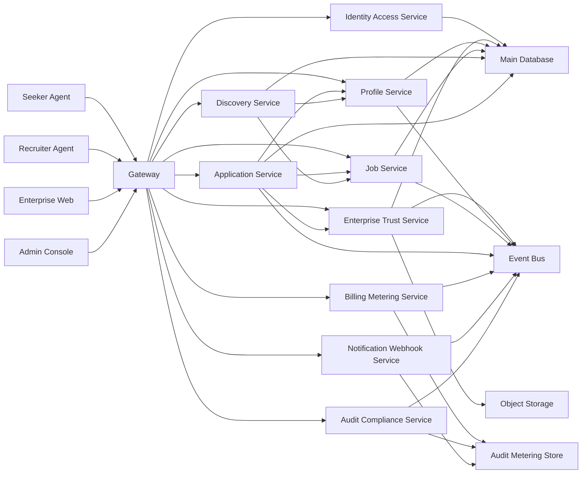
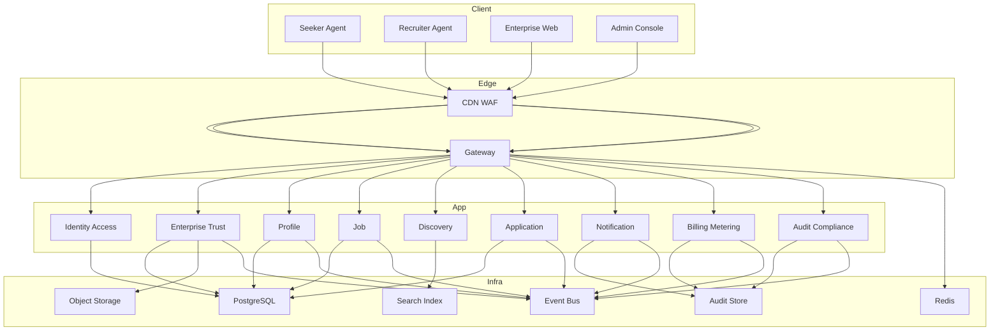
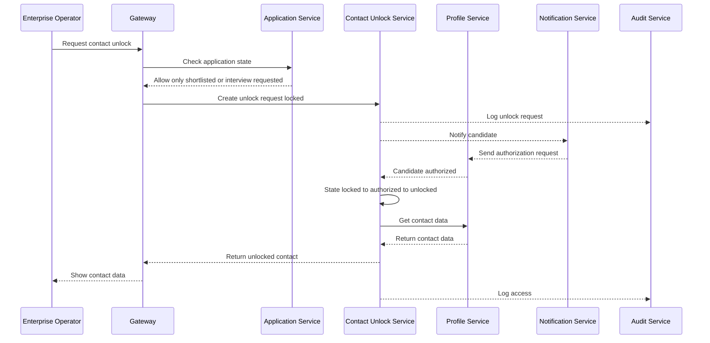
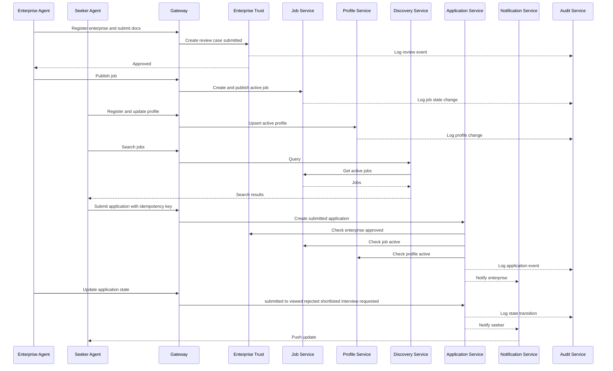
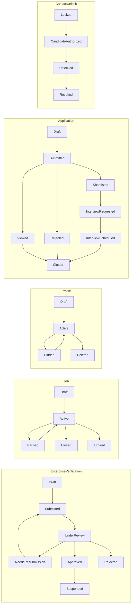
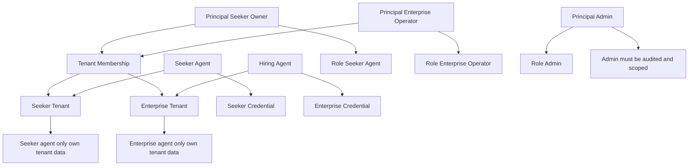
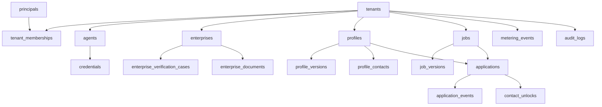
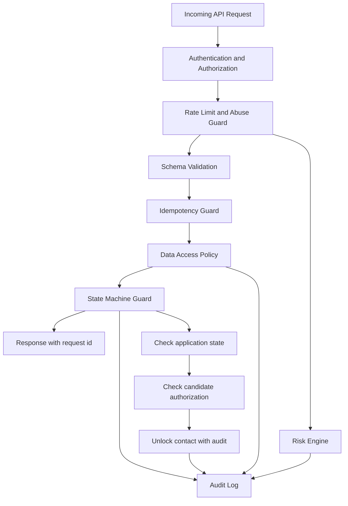

# AgentHire Architecture (VSCode Compatible)

## 1) Logical Service Architecture

## 2) Deployment Architecture

## 3) Contact Unlock Sequence

## 4) Hiring Core Flow Sequence

## 5) State Machines Overview

## 6) Tenant And Access Model

## 7) Core Data Model

## 8) Security And Governance Controls

