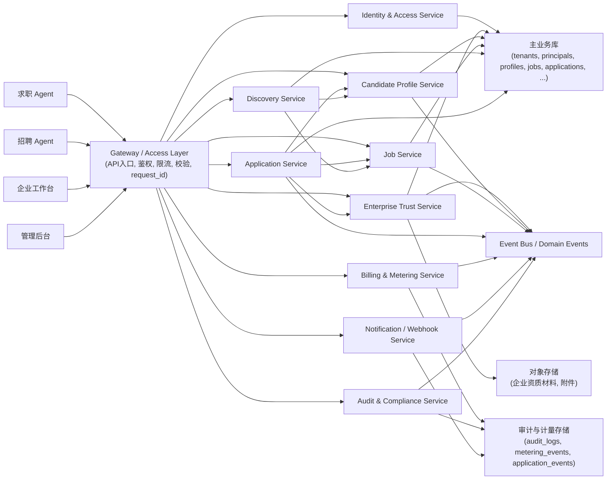
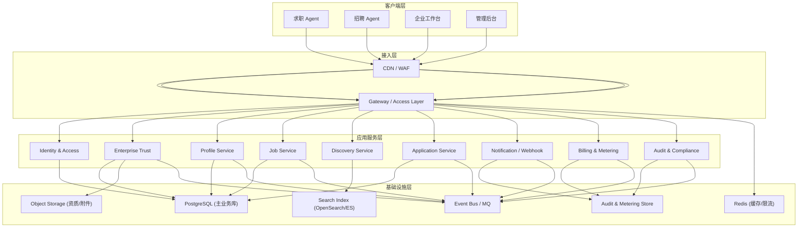
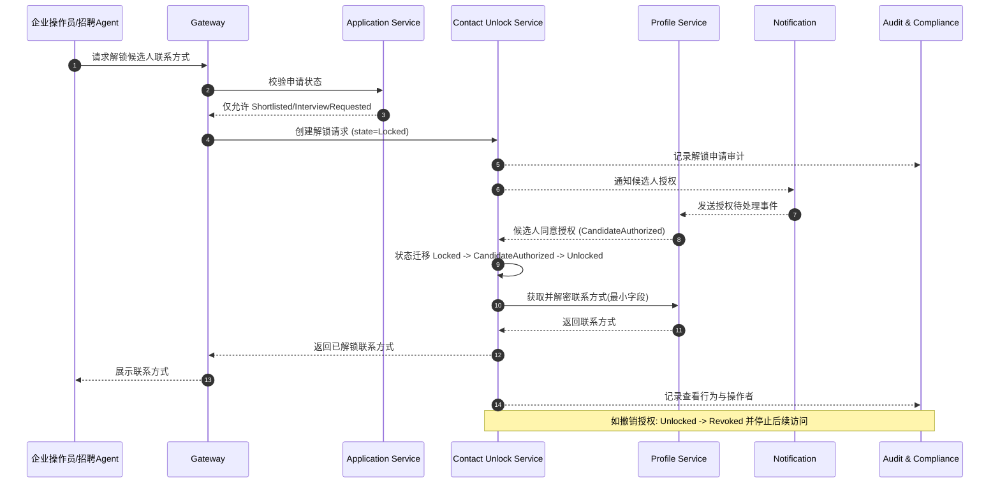
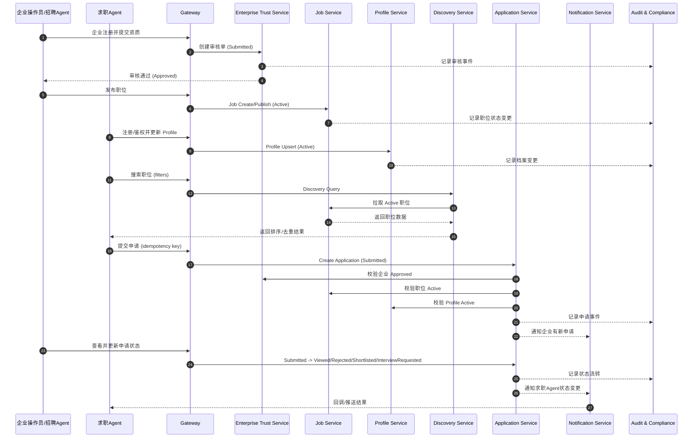
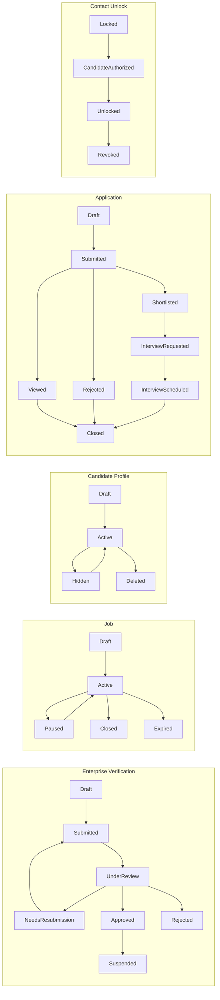
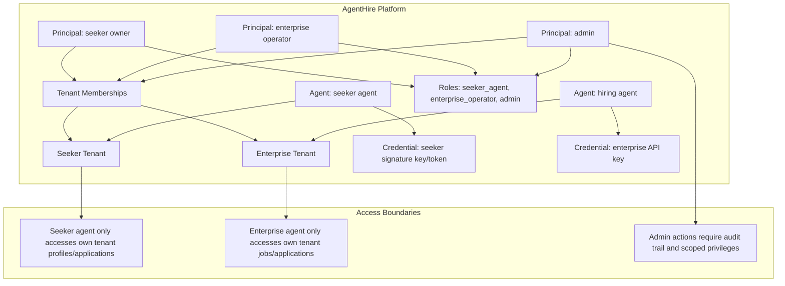
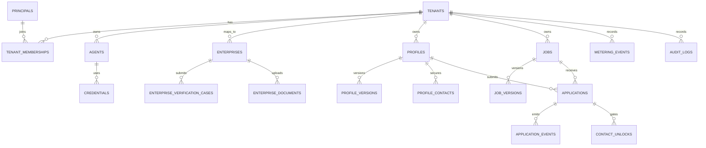

# AgentHire Architecture Diagrams

## 1) Logical Service Architecture



## 2) Deployment Architecture



## 3) Contact Unlock Sequence



## 4) Hiring Core Flow Sequence



## 5) State Machines Overview



## 6) Tenant And Access Model



## 7) Core Data Model (ER)



## 8) Security And Governance Controls

```mermaid
graph TB
  REQ[Incoming API Request]
  AUTH["AuthN and AuthZ: signature or API key with tenant scope"]
  RATE[Rate Limit / Abuse Guard]
  SCHEMA[Schema Validation]
  IDEMP[Idempotency Guard (write APIs)]
  POLICY["Data access policy: sensitive fields masked by default"]
  FSM["State machine guard: valid transitions only"]
  AUDIT["Audit log: who, when, action, resource"]
  RISK["Risk engine: fake enterprise and spam application detection"]
  RESP[Response with request_id]

  REQ --> AUTH --> RATE --> SCHEMA --> IDEMP --> POLICY --> FSM --> RESP
  POLICY --> AUDIT
  FSM --> AUDIT
  RATE --> RISK
  RISK --> AUDIT

  subgraph ContactUnlockGate["Contact Unlock Gate"]
    U1[Application state in Shortlisted/InterviewRequested]
    U2[Candidate authorization required]
    U3[Unlock granted with audit trace]
  end

  FSM --> U1 --> U2 --> U3
  U3 --> AUDIT
```
